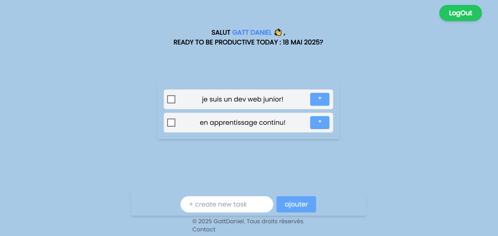

# 📝 To-Do List App - React + Firebase

Une application web simple et rapide pour gérer ses tâches quotidiennes, développée avec **React.js**, **Tailwind CSS** et **Firebase** (Firestore + Auth). ✨

## 🚀 Fonctionnalités

- 🔐 Authentification (inscription, connexion, déconnexion, mot de passe oublié)
- 📋 Création, suppression et afficharge de tâches
- ✅ Marquage de tâches comme complétées
- 📱 Design responsive (adapté mobile & desktop)
- ☁️ Stockage en temps réel via Firebase Firestore

## 🧰 Technologies utilisées

- **React.js** (Vite)
- **Tailwind CSS**
- **Firebase (Firestore + Auth)**
- **React Context API**
- **React Router DOM**

## 📸 Aperçu



## 🛠️ Installation locale

1. **Clone le repo** :
   ```bash
   git clone https://github.com/gattdaniel/to-do-reactjs.git
   cd to-do-reactjs
